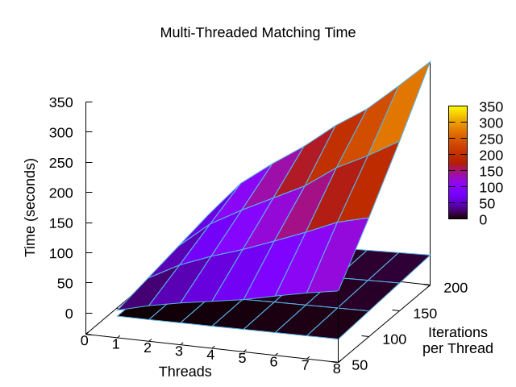

# Red Performance

Benchmarks were done on a laptop (with AC power), but should be
relatively representative.  The host has two Intel i7-6600U cores at
2.6GHz (HyperThreaded) and 16GB of RAM.  The operating system is Linux
5.15.75.

## Compilation

Both time and memory usage appear proportional to the number of states
in the non-minimized DFA, which can be exponential in the number of states
in the NFA, which roughly corresponds to regex number, length, and
complexity.
The following results are from loading N words from `/usr/share/dict/words`
as regexes with sequential result values and building them into one DFA.

What's most clear is that `fLooseStart` is expensive.
Combining it with `fLooseEnd` is even more expensive,
effectively constraining how many regexes can be compiled together.
Curiously, case-sensitive matching appears more expensive than
treating upper- and lower-case as equivalent.


If the patterns populating the DFA are all fixed strings, the
`addExact()` method can be used.  Tests have shown a 14% drop in
compilation time, along with a 42% reduction in memory use.  This
special-case optimization skips regex parsing and emits the minimum
required NFA states.

See the `Budget` class for a way to prevent runaway allocation.
The budget can be specified in terms of number of states.
Actual bytes depends on the density of the automaton transitions.
Quick tests suggest a peak memory cost of 11-22 kB per state
on a 64-bit platform.
Detailed curve fits suggest the relationship is quadratic.
Assuming `b` is bytes of memory used and `s` is number of states:
```
b(s) = j*s^2 + k*s + l
```
| Regexes    | j     | k     | l      |
| ---------- | ----- | ----- | ------ |
| raw word   | 0.036 | 818   | 1.0    |
| .* word    | 0.504 | 8692  | 0.871  |
| .* word .* | 0.001 | 15843 | -3.3e6 |

## Matching

In general, simple matching operations are similar in speed to **RE2**.

Multi-pattern matching, however is much faster with **Red** than **RE2::Set**.
The following 3D plot shows results for matching a set of N patterns
consisting of words from `/usr/share/dict/words` against the entire `words`
file.  Compilation is done once and matching is repeated M times.
Overall, **RE2::Set** takes 10x as long as **Red**.


### Usage Tradeoffs

Matching for a bunch of patterns of the form `.*foo` will be faster
than iteratively matching for `foo` etc., but will involve a larger
DFA that takes longer to compile.  This should only be a consideration
for DFAs populated with large numbers of patterns.  For truly large
sets of patterns, the leading `.*` or using `fLooseStart` is not
practical.

The fixed-prefix (i.e.: leader) optimization is not always beneficial.
In the `Matcher.h` interfaces, this corresponds to `doLeader`.
Sometimes `match<styLast, false>()` is faster than `match<styLast, true>()`.
This is due to disabling the check for the fixed prefix string.
Certain DFAs may be known not to have such a prefix,
in which case the processing is wasted.  Using `match<styLast, false>()`
avoids this waste.

## Threads

**Red** compilation and matching are inherently single-threaded
and make no special use of shared data.  Matching is read-only.
So, they can proceed independently in separate threads,
with the only interactions being `malloc` locks and similar.

This is in contrast to `RE2`, which uses a lock around the compiled
program.  The cost of this can be seen in a benchmark that invokes
matching at high rates across multiple threads of execution.

Here are wall-time results for N threads doing M iterations each
of a sliding match for a single simple regex across the contents of
`/usr/share/dict/words`. `RE2` results are on top.



With a single thread, **Red** is 12x the speed of `RE2`,
which is suggestive of some extra overhead acquiring an uncontended lock.
Going to two or more threads, **Red** is around 24x the speed of `RE2`,
suggesting that once the lock becomes contended,
it becomes twice as expensive.
Here are some raw numbers (times in milliseconds):

| Threads | Iters |   Red |    RE2 | Factor |
| ------- | ----- | ----- | ------ | ------ |
| 1       |    50 |   851 |  10562 | 12.41  |
| 1       |   100 |  1704 |  21072 | 12.37  |
| 1       |   150 |  2551 |  31608 | 12.39  |
| 1       |   200 |  3406 |  42177 | 12.38  |
| 2       |    50 |   895 |  24101 | 26.93  |
| 2       |   100 |  1790 |  48634 | 27.17  |
| 2       |   150 |  2691 |  74036 | 27.51  |
| 2       |   200 |  3600 |  98709 | 27.42  |
| 3       |    50 |  1399 |  34394 | 24.58  |
| 3       |   100 |  2636 |  68885 | 26.13  |
| 3       |   150 |  4269 | 102789 | 24.08  |
| 3       |   200 |  5724 | 137026 | 23.94  |
| 4       |    50 |  1684 |  42965 | 25.51  |
| 4       |   100 |  3351 |  85951 | 25.65  |
| 4       |   150 |  5050 | 128654 | 25.48  |
| 4       |   200 |  7146 | 171502 | 24.00  |
| 5       |    50 |  2304 |  51557 | 22.38  |
| 5       |   100 |  4678 | 105729 | 22.60  |
| 5       |   150 |  7020 | 154494 | 22.01  |
| 5       |   200 |  9157 | 211832 | 23.13  |
| 6       |    50 |  2787 |  63371 | 22.74  |
| 6       |   100 |  5586 | 126299 | 22.61  |
| 6       |   150 |  8290 | 190480 | 22.98  |
| 6       |   200 | 11011 | 245252 | 22.27  |
| 7       |    50 |  3212 |  74336 | 23.14  |
| 7       |   100 |  6486 | 148638 | 22.92  |
| 7       |   150 |  9673 | 216505 | 22.38  |
| 7       |   200 | 12857 | 289295 | 22.50  |
| 8       |    50 |  3668 |  83459 | 22.75  |
| 8       |   100 |  7348 | 162083 | 22.06  |
| 8       |   150 | 10994 | 246128 | 22.39  |
| 8       |   200 | 14673 | 335277 | 22.85  |

Looking at `RE2`, it appears that 4 threads doing 50 iterations each
took longer than 1 thread doing 200.
This is consistent with serialization caused by locking.
In contrast, **Red** can use 4 threads doing 50 to do the same work
as 1 thread doing 200, but in less than half the time.
Ideally, we'd like to see 4 threads use one quarter of the time,
but this host has only 2 physical CPU cores,
and uses Hyper-Threading to simulate 4 cores.
Further clouding the picture is Turbo Boost technology
that reduces the clock frequency when all cores are busy.
