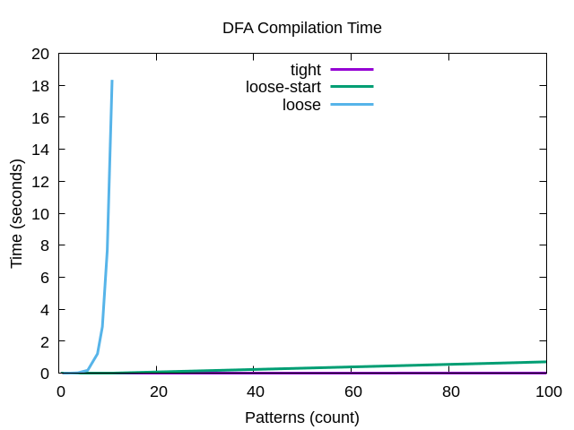
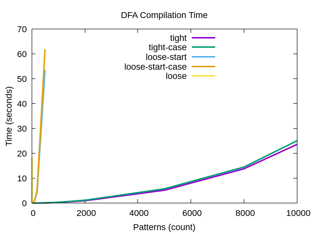
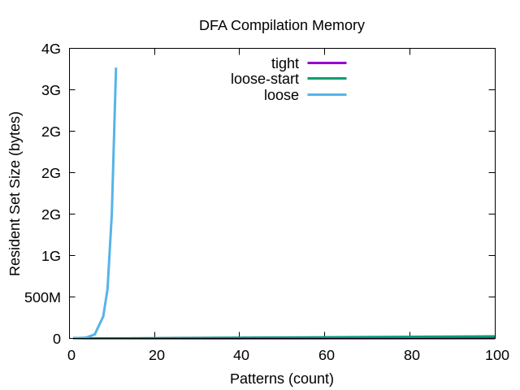
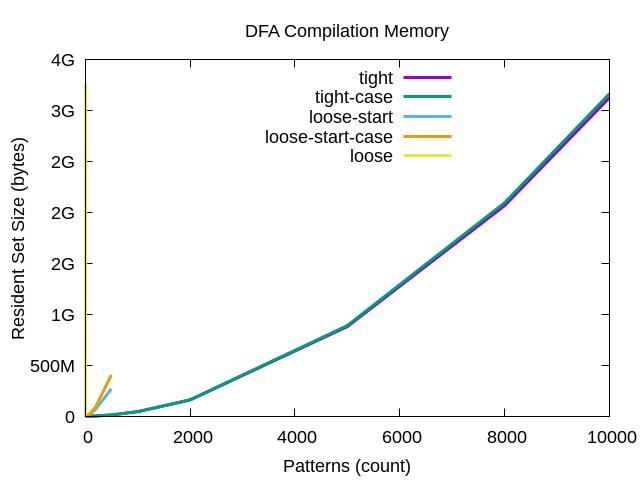
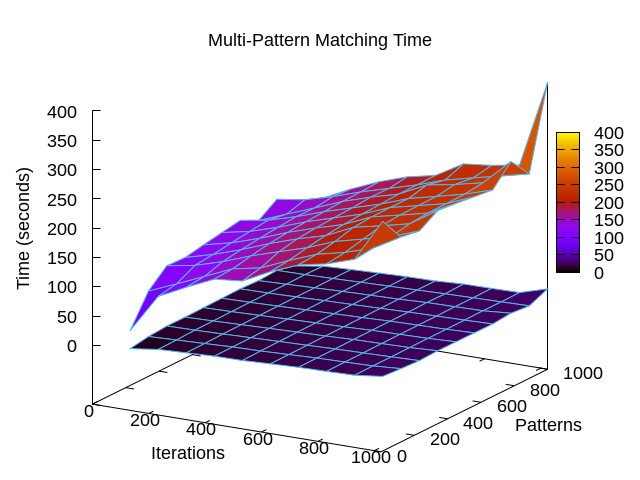

# Red Performance

Benchmarks were done on a laptop (with AC power), but should be
relatively representative.  The host has two Intel i7-6600U cores at
2.6GHz (HyperThreaded) and 16GB of RAM.  The operating system is Linux
5.15.75.

## Compilation

Both time and memory usage appear proportional to the number of states
in the non-minimized DFA, which can be exponential in the number of states
in the NFA, which roughly corresponds to regex number, length, and
complexity.
The following results are from loading N words from `/usr/share/dict/words`
as regexes with sequential result values and building them into one DFA.

What's most clear is that `fLooseStart` is expensive.
Combining it with `fLooseEnd` is even more expensive,
effectively constraining how many regexes can be compiled together.
Curiously, case-sensitive matching appears more expensive than
treating upper- and lower-case as equivalent.






See the `Budget` class for a way to prevent runaway allocation.
The budget is specified in terms of number of states.
Actual bytes depends on the density of the automaton transitions.
Quick tests suggest a peak memory cost of 11-22 kB per state
on a 64-bit platform.
Detailed curve fits suggest the relationship is quadratic.
Assuming `b` is bytes of memory used and `s` is number of states:
```
b(s) = j*s^2 + k*s + l
```
| Regexes    | j     | k     | l      |
| ---------- | ----- | ----- | ------ |
| raw word   | 0.036 | 818   | 1.0    |
| .* word    | 0.504 | 8692  | 0.871  |
| .* word .* | 0.001 | 15843 | -3.3e6 |

## Matching

In general, simple matching operations are similar in speed to **RE2**.

Multi-pattern matching, however is much faster with **Red** than **RE2::Set**.
The following 3D plot shows results for matching a set of N patterns
consisting of words from `/usr/share/dict/words` against the entire `words`
file.  Compilation is done once and matching is repeated M times.
Overall, **RE2::Set** takes 10x as long as **Red**.



### Usage Tradeoffs

Matching for a bunch of patterns of the form `.*foo` will be faster
than iteratively matching for `foo` etc., but will involve a larger
DFA that takes longer to compile.  This should only be a consideration
for DFAs populated with large numbers of patterns.  For truly large
sets of patterns, the leading `.*` or using `fLooseStart` is not
practical.

The fixed-prefix (i.e.: leader) optimization is not always beneficial.
In the `Matcher.h` interfaces, this corresponds to `doLeader`.
Sometimes `match<styLast, false>()` is faster than `match<styLast, true>()`.
This is due to disabling the check for the fixed prefix string.
Certain DFAs may be known not to have such a prefix,
in which case the processing is wasted.  Using `match<styLast, false>()`
avoids this waste.
